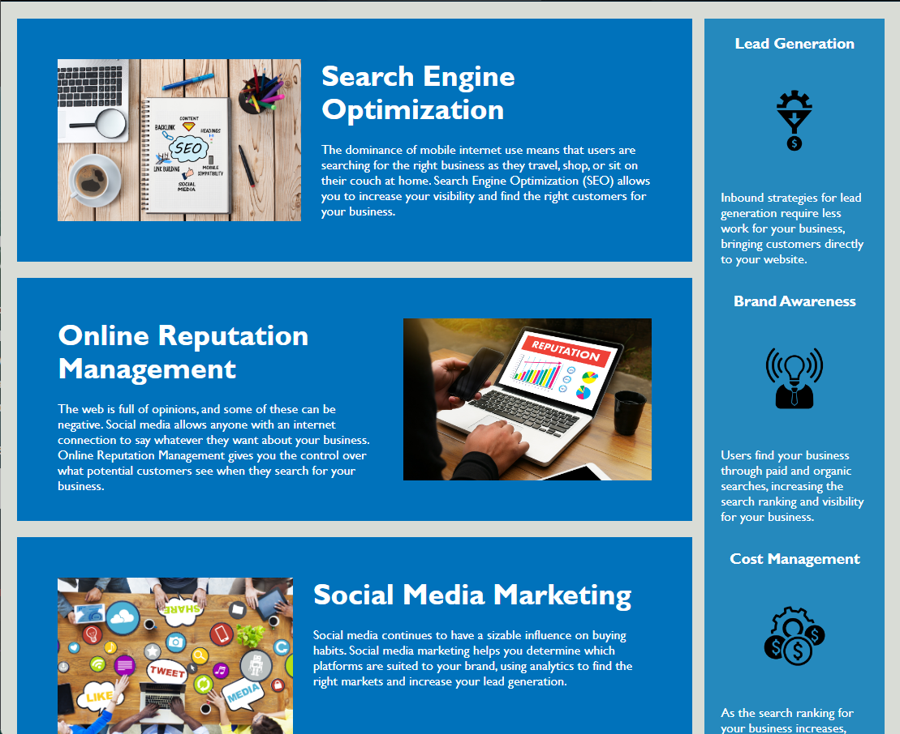

# Module 1 Challenge
In this module challenge, I condensed elements in the stylesheet to look neater. I also got rid of divs and changed them to footer, header, and sections where appropriate, so that there was not random div class="" elements all over. I also fixed the search engine optimization link so that it had a destination.

## Screenshots

